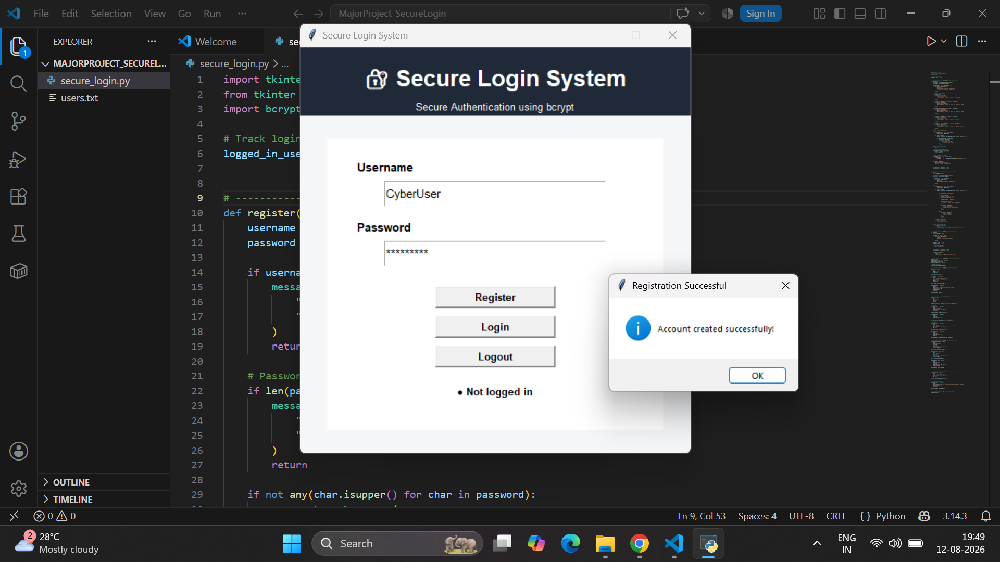
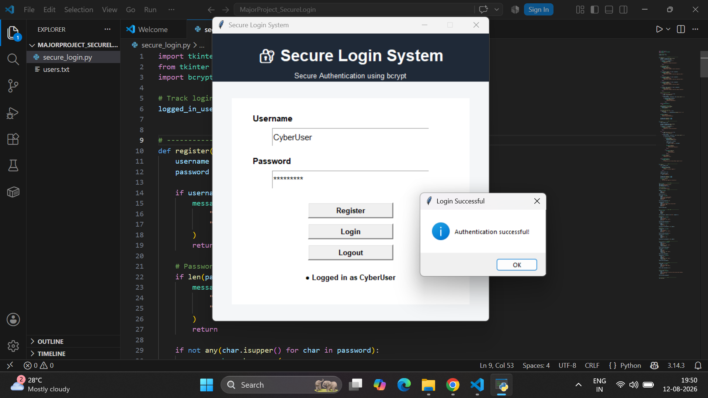
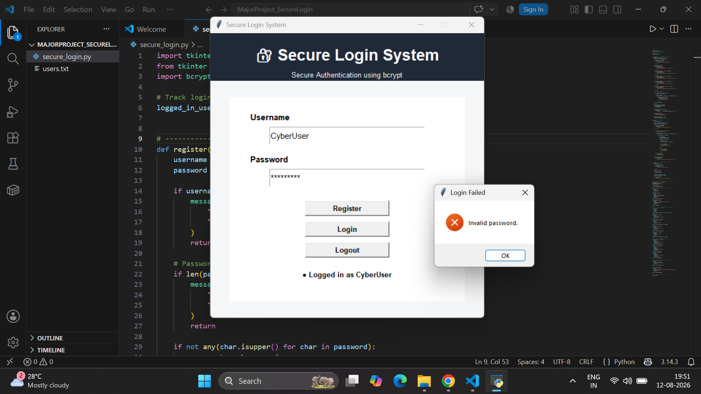
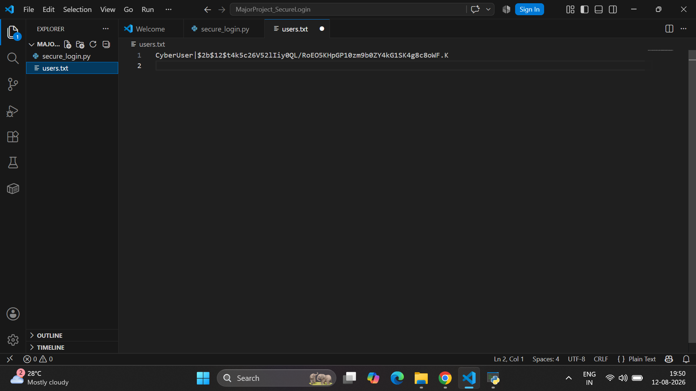
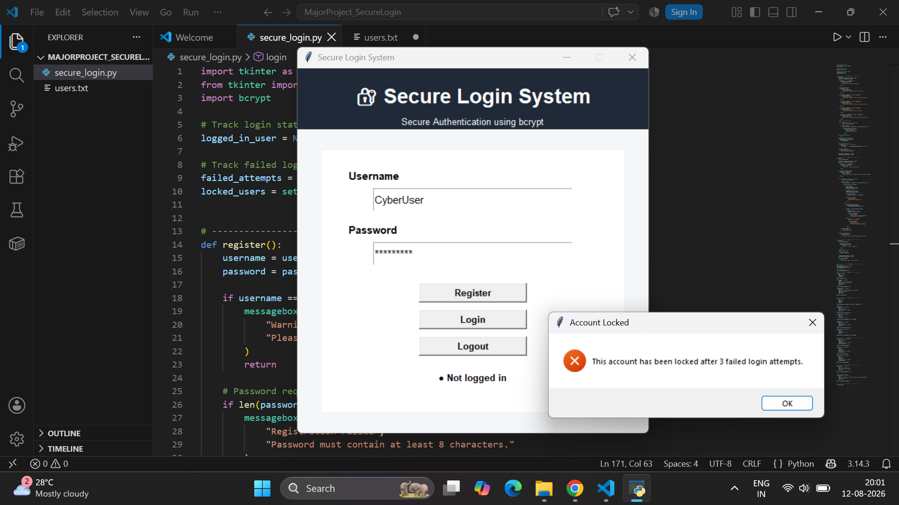
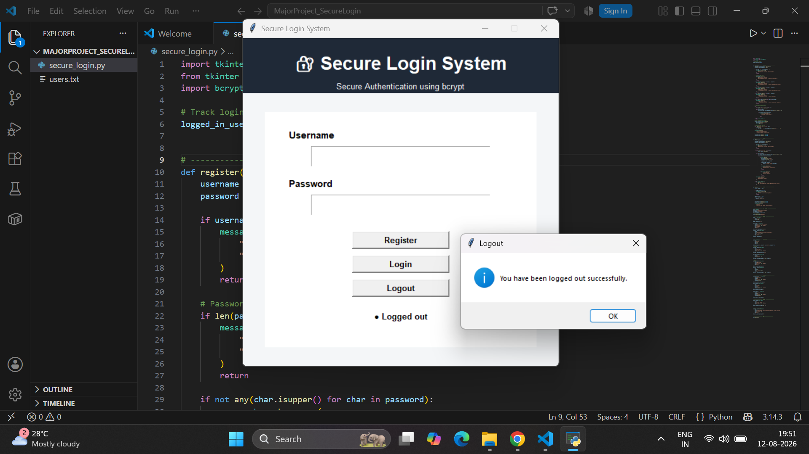

# Secure Login System with Encryption

A cybersecurity project developed during an internship to implement secure user authentication and protect user credentials using encryption and password hashing techniques.

## Technologies Used

- Python
- Encryption
- Password Hashing
- Authentication
- Tkinter
- Cybersecurity

## Features

- Secure user registration and login
- Password protection using hashing techniques
- Encryption for enhanced data security
- User-friendly graphical interface
- Authentication and credential validation
- Support for multiple user accounts

## Project Screenshots

### Registration

### Login Success

### Login Failure

### Password Hashing

### Account Locked

### Logout

## Project Report

The detailed project report is included in this repository.

## Purpose

The project demonstrates the implementation of basic cybersecurity principles for secure authentication and protection of user credentials.

## Author

Anuja Shetty
